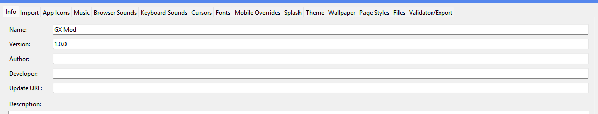
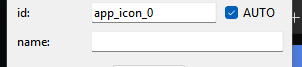
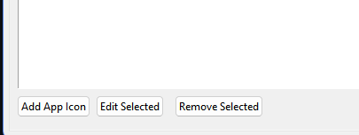
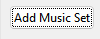
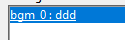
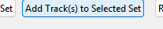
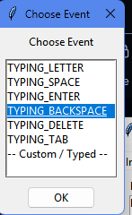
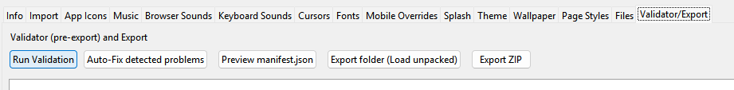

# GX-Builder

### An essential utility designed to streamline the creation of custom Opera GX mods.

---

## Requirements

* **Python:** Ensure you have the latest version of [Python](https://www.python.org/downloads/) installed.

## Guide

#### 1. Download the Latest Release
Download the software from the [Releases](https://github.com/Open-GX/GX-builder/releases) page.

> *Note: We cannot guarantee that everything will function perfectly at all times, as this is a community project.*

#### 2. Launch the Builder
Run the `builder.py` script to start the application.

#### 3. Prepare Your Assets
Gather all necessary files, including MP4 videos for splash screens or wallpapers, images, and audio files.

#### 4. Project Information
Input your Developer Name, Mod Name, Version, and Author Name in the provided info boxes. 

> **Important:** The Update URL must be a valid link; if you do not have one, please leave the field blank.

#### 5. Assigning File Names
Enter your desired file names in the field below the ID. Available options will appear in the section below the main display after importing.

#### 6. Adding Audio
Select "Add Music Set" or "Add Pack" and assign a name. Click the created entry to add tracks. Ensure you click "OK" on the resulting popup to confirm the selection; otherwise, the tracks will not be registered.

*Specific to Keyboard sounds:*

#### 7. Validation
Once all files are added, navigate to the **Validator/Export** section. Run the validator and resolve any reported errors to ensure your mod is compatible.

> *Note: We do not guarantee that the Validator is always 100% accurate; please double-check your file structures.*

#### 8. Exporting
**Required:** Select "Export (Load unpacked)" to save your files into a dedicated folder.

#### 9. Installation
Follow the integration guide at [KittyOperaGXMOD](https://github.com/Open-GX/KittyWindowsXP-OperaGX-mod) to import your mod into Opera GX.

#### 10. Zip Export
The "Export Zip" feature is intended for verified creators and may not function for unofficial mod submissions.

---

## File Specifications

* **Splash Screen:** MP4 format, 1080x1080 resolution, 5-second duration, H.264 codec, and AAC audio.
* **Icons:** The `512.png` file must be exactly 512x512 pixels.
* **Audio:** Keyboard sounds support `.wav` or `.mp3`. Background music and interface sounds must be in `.mp3` format.

## Untested Features

* **Mobile Overrides:** Currently untested, as this feature requires official support from the Opera Mod Store.

---

### **Legal Disclaimer**

**GX-Builder is an independent, third-party utility and is not affiliated with, sponsored by, or endorsed by Opera or Opera GX.** This software is provided "as is," without warranty of any kind. This project aims to simplify the modding process for the community; however, the developers are not responsible for any issues arising from its use. 

Please do **not** contact official Opera GX support regarding mods created with this tool. For technical assistance or bug reports, please open an entry in our [GitHub Issues](https://github.com/Open-GX/GX-builder/issues) tab.

> *Note by Natalie: Bonjour! We hope you like the project. If you have any ideas, please create an issue with the **enhancement** label!*